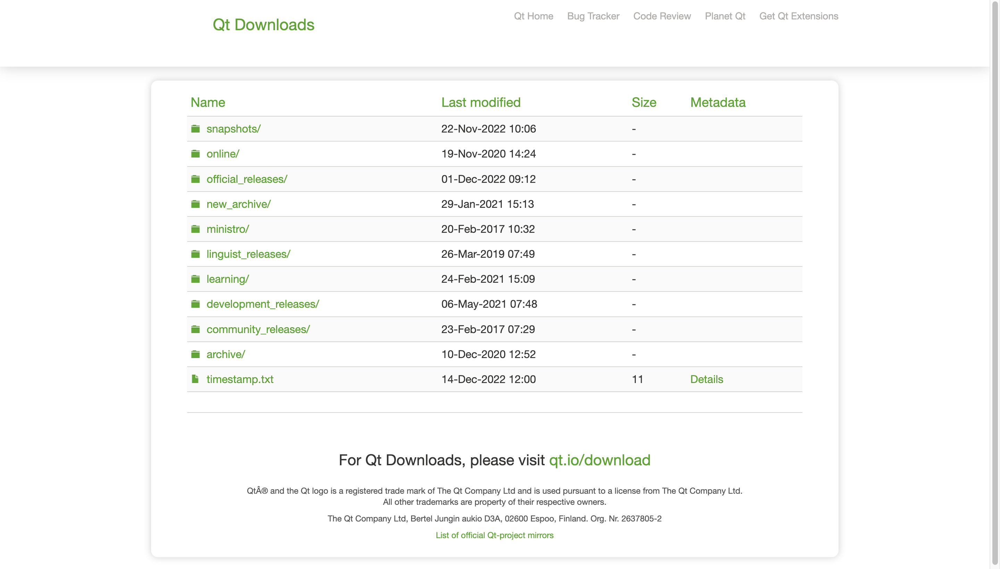
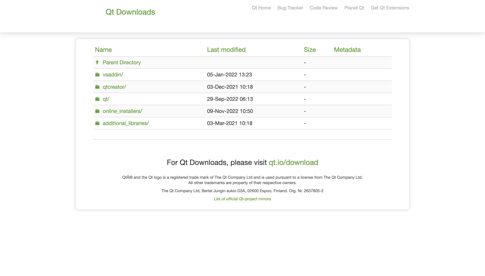
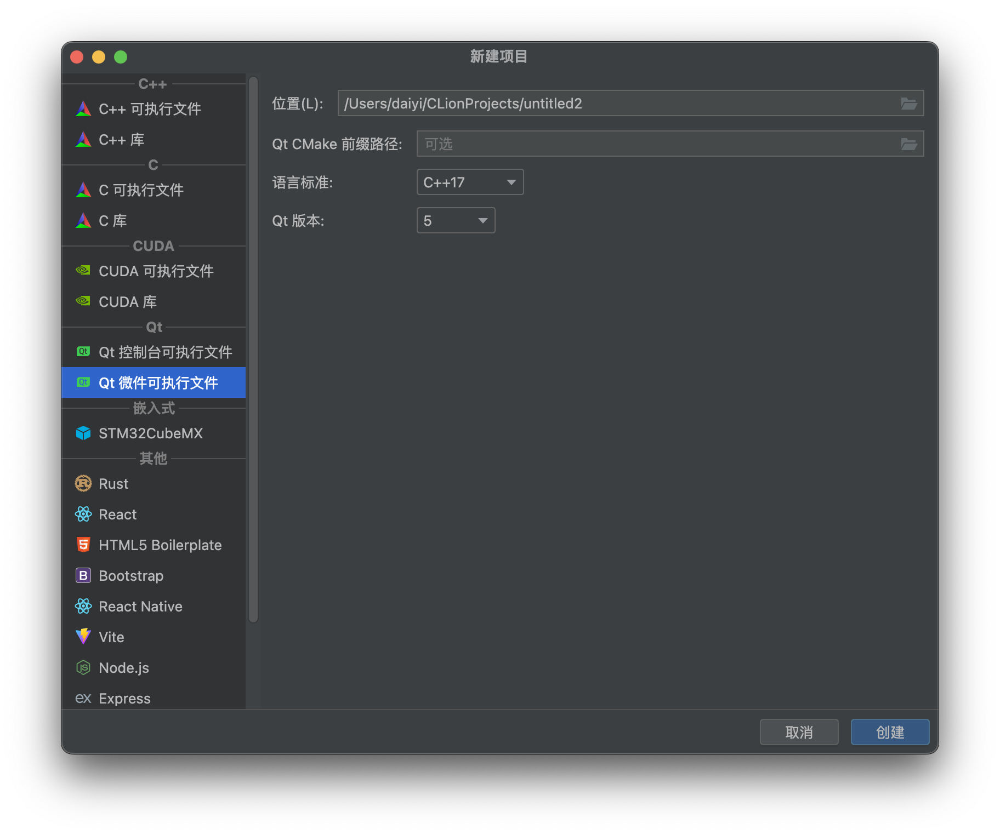
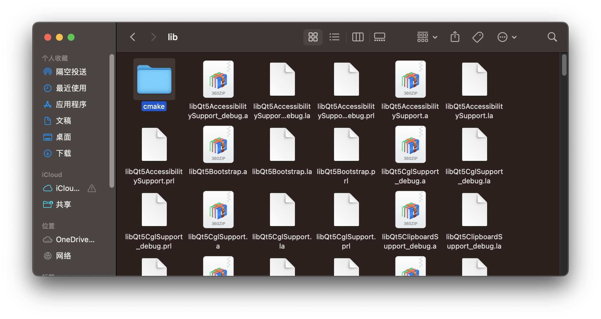
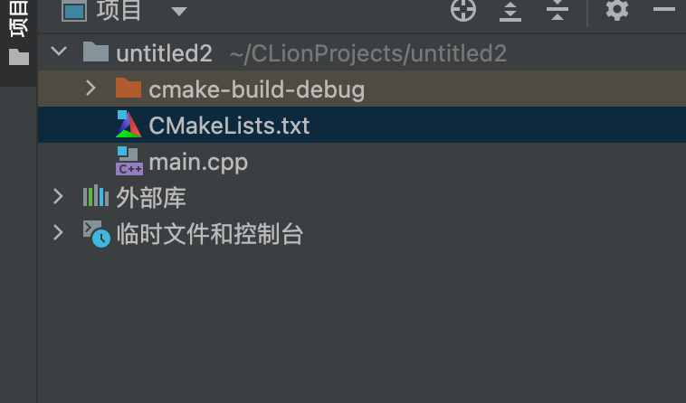
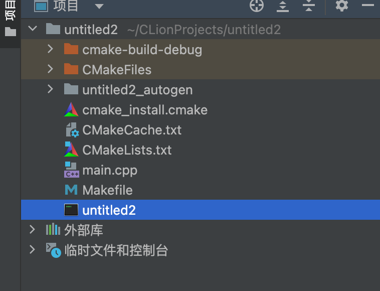

#使用CLion在M1芯片的mac上配置Qt开发环境（cmake版）
最近想研究一下C++的Qt，好让我的程序不局限于黑框框<br>
但是Qt Creator的界面实在太丑了。偶然间发现CLion可以写Qt项目，那不得搞一搞~~其实我原来想配置VS Code的了但是一直没成功~~<br>
##第一步：下载并安装Qt和CMake
这个去Qt的官网直接下载就好了，此外还有几个国内的镜像网站
[Qt官网](http://download.qt.io/)
进入官网后，你会看到这样的界面

然后就点击archive/

然后点击qt<br>
会出现一大堆版本号<br>
然后选择自己需要的版本号和对应的环境（我这里使用5.9.0作演示~~其实是因为我买的的书是5.9的~~，推荐大家选择LTS版本）<br>
一般来看这个博客的人用的都是mac，所以我们选择 qt-opensource-mac-x64-5.9.0.dmg这个包<br>
下载完之后就可以一路点继续<br>
有几点注意：<br>
安装的时候它可能会让你登陆账号，你直接skip就行了<br>
安装的时候它会让你选择安装什么组件，Tools一定要选，Qt里的第一个一定要选，剩下的除了Android和最后一个Qt Script都可以安装（这个主要看你用Qt做什么，按自己的需求选）<br>
然后就等到Qt安装完。<br>
接下来我们来搞cmake
首先去[CMake下载网址](https://cmake.org/download/)去下载CMake（版本要找合适的）
下载完后打开CMake那个应用程序，再打开一个终端，输入
``` sudo "/Applications/CMake.app/Contents/bin/cmake-gui" --install```
然后检查一下
输入
```which cmake```
如果能出来路径就说吗安装成功
##第二步：在CLion中新建Qt项目
注意本文讲述的是cmake来编译，如果在Qt Creator中创建新项目则默认使用的是qmake
如图

选择的时候一定要选择Qt微件可执行文件，这样CLion会自动帮你配制好Qt的库文件<br>
然后语言标准和Qt版本选择自己安装的<br>
**这时不要着急点创建，我们必须要配置Qt CMake前缀路径！**<br>
##第三步：配置Qt CMake前缀路径
首先我们需要找到你的Qt安装路径，如果在安装Qt的时候你一路点下去的话就在/Users/"你的用户名"/下面<br>
比如我的就是在/Users/daiyi/Qt5.9.0<br>
进入之后先点版本号那个文件夹，然后是clang_64，然后是lib，就可以找的一个名为cmake的文件夹<br>
这个就是Qt CMake的路径了

然后回到CLion，将Qt CMake前缀路径里找到cmake那个文件夹，然后点Open<br>
你的路径大概是/Users/"你的用户名"/Qt5.9.0/5.9/clang_64/lib/cmake<br>
然后就可以愉快地创建了<br>
##第四步：配置CMakeLists

点开CMakeLists.txt
然后在"set(CMAKE_AUTOUIC ON)"后面加上一句<br>
```set(CMAKE_OSX_ARCHITECTURES "x86_64")```
这句话的作用是为了让编译的时候链接的库为x86-64架构的，不然就会编译失败<br>
有的同学可能会问了：M1芯片不是ARM的吗为什么要设置成x86-64啊<br>
这是因为我们下载Qt是x86-64版本的，它的库文件是x86-64架构的，链接的时候要用x86-64链接。<br>
然后我们在终端里输入
```cmake ./```
然后你就会看见有一个文件叫做Makefile生成<br>
这就是CMakeLists生成的Makefile，通过Makefile就可以直接生产可执行文件了<br>
终端输入
```make```
如果你的配置完全正确，就会发现有一个可执行文件生成！<br>

然后在终端里输入
```./untitled2```
(这块untitled2需要替换成你的可执行文件的名字)
然后就能看到程序的窗口出来了！<br>
完成！